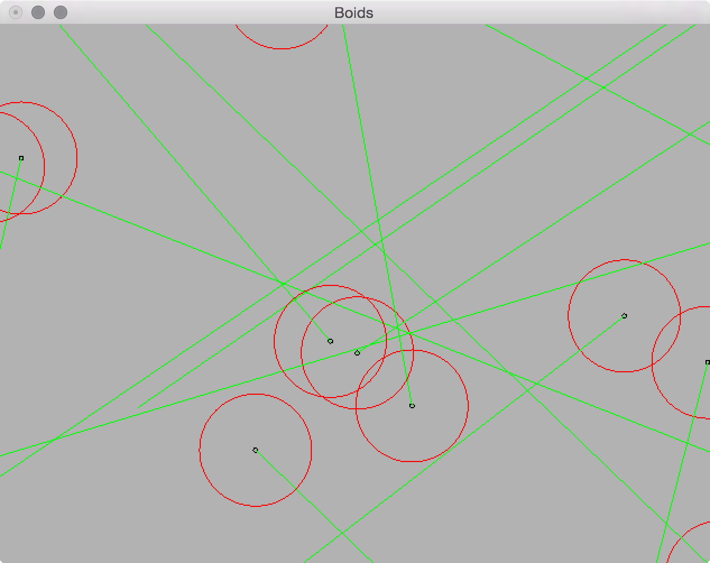

# Boids!

[](https://travis-ci.org/cs383-final/cs383-finalproject)

Boids is a simple artificial life simulation that mimicks the flocking behaviour of birds. This implementation of Boids was written in Haskell by [Hawk Weisman](http://hawkweisman.me) and [Willem Yarbrough](github.com/yarbroughw) for Computer Science 383 at Allegheny College.




## Building Boids

You can build `boids` with `cabal install -j` in the project's root directory. If you plan on working on a lot of other Haskell projects on your system, you may want to run `cabal sandbox init` first, in order to manage `boids`' dependencies independantly of those of other Haskell projects.


## Running Boids

To run our simulation, just launch the `boids` executable, which Cabal will build to `dist/build/boids/boids`.

`boids` supports the following command-line parameters:
```
Boids
  -d         --debug          Show debug mode
  -c         --cohesive       Cohesive boid behaviour
  -s         --swarm          Swarming boid behaviour
  -e         --equal          Equal-weighted boid behaviour
  -x HEIGHT  --height=HEIGHT  Window height (pixels)
  -y WIDTH   --width=WIDTH    Window width (pixels)
  -n BOIDS   --num=BOIDS      Number of boids in the simulation
  -h         --help           Show this help file
  ```
